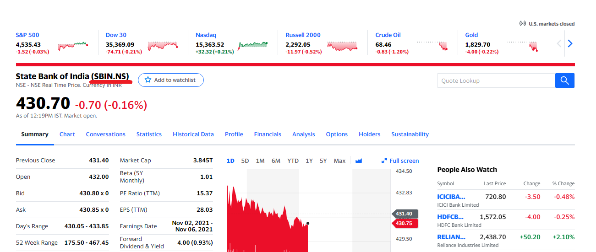

# Stock Price Prediction Using Machine Learning

In this project we will predict stocks closing price using machine learning. We will grab the stocks history using Yahoo Finance Api.
And based on that we will train our model and trying to predict the stock closing price.


## Deployment

To deploy this project first we need to install all python libraries which we are using for that run

```bash
  pip install -r requirements.txt
```
```bash
  python ./main.py
```

After Running the script you will asked to enter Stock Symbol which you can find it from https://finance.yahoo.com/


