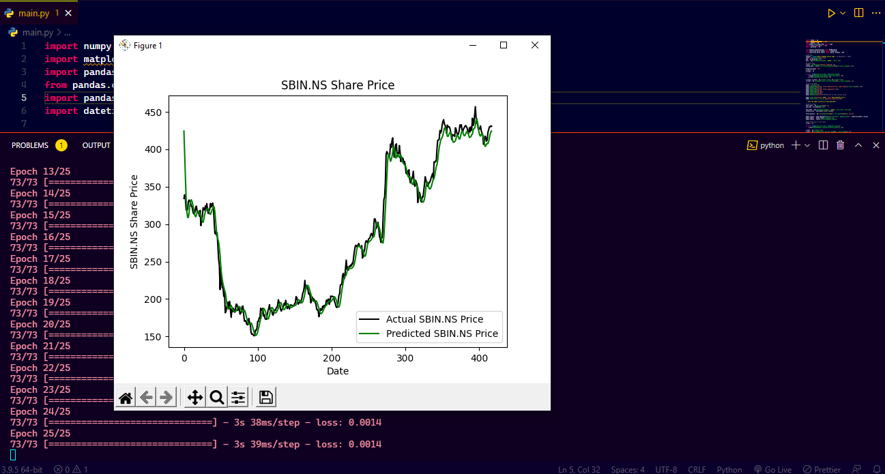

# Stock Price Prediction Using Machine Learning

In this project we will predict stocks closing price using machine learning. We will grab the stocks history using Yahoo Finance Api.
And based on that we will train our model and trying to predict the stock closing price.


## Deployment

To run this project first we need to install all the python libraries which are required.

```bash
  pip install -r requirements.txt
```
```bash
  python ./main.py
```

After Running the script you will asked to enter Stock Symbol which you can find it from https://finance.yahoo.com/


After that enter the symbol code of stock.


Here our model will be trained train.


After that you can check the actual and predicted price graph.


At last, finally you will be able get the predicted closing price for the stock.


## Note:
It is only a project which predicts the closing price based on their past closing history only.
We will not say that our prediction is 100% accurate. Therefore, before investing in any stock, do your research thoroughly.
